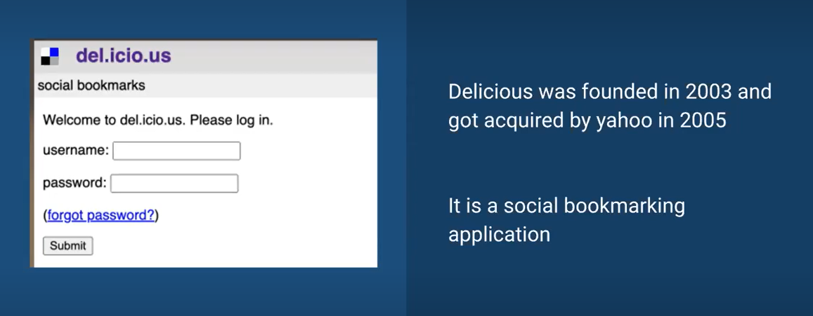
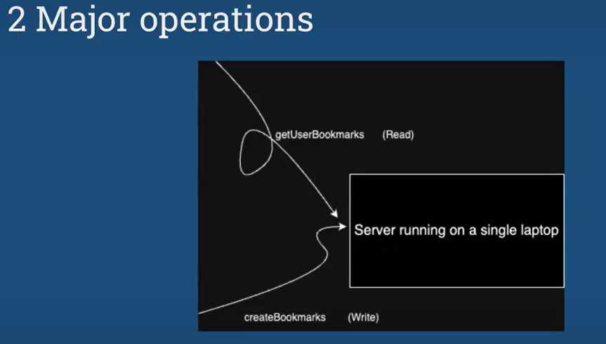

# High Level Design

- Architecture Design of the System [No Coding]
- What are the components?
- Communication b/w componenets
- How the storage will work?
- How to handle scale?

# Story of Delicious



## Interesting Fact
For a very long period of time the servers of Delicious were running on personal machines/laptops.



# App Architecture

- Client - Anything that allow users to interact with the app is your client side.
Client is just an uber level component having very complex components inside. eg, Client storage, Client Rendering Engine

```
Happy path is optimized series of steps that a user takes to complete their goal. The opposite to a happy path are edge cases and error states.
```
- Server - Any machine/process running on a machine that takes some input process the input and give the response.

Server is just an uber level component having very complex components inside. eg, LB, cache, DB, Web Servers, MQ etc.

- DNS - DNS, or the Domain Name System, translates human readable domain names (for example, www.amazon.com) to machine readable IP addresses (for example, 192.0.2.44).


How do we know which DNS to hit?

- Generally ISP provides us this info.
- Google also provides free DNS servers.
- For Delicious, the DNS returned the IP of the laptop running the server.

## Problems of Low machine config
Now if we assume that more users will onboard on our app with time. Then a single machine won't be able to serve all the traffic.

- Traffic issues
- With every new bookmark storage left was reducing
- RAM on a single machine won't be sufficient.
- Disk storage will also reduce
- No. of simultaneous connection won't be enough
- Computation capacity of system will be less

## Let's buy a bigger machine then?

- In earlier days, people used to upgrade to higher machine config.

- If let's say we are out of disk storage them we can buy a machine with a higher disk storage.

- We call it as Vertical scaling.

## Vertical Scaling

- Increasing the power of Machines

### Problems with Vertical Scaling

- We cannot always correctly anticipate the amount of traffic we will get later.

- Due to this during necessity we upgrade the machine, but it can be a repetitive process and migration to a new heavier machine will be costly.

- There is a logical limit to how much more powerful machine we can get.

- If we just have a single machine running the server, it can cause single point of failure.

- We cannot very easily reduce machine size when there is low traffic.


### Key points about Vertical Scaling

- It can lead to Single point of failure.

- We don't need much network calls here as inter process communication can be sufficient.

- Consistency can be easily managed.

- Can lead to downtime.

- Less complexity and less management required.

- Workload can be spread in multiple cores of the machine.

## Horizontal Scaling

- Increasing the count of Mediocre Machine.

- Rather than investing on getting more powerful machine why now have multiple machine of relatively mediocre power to handle all the load together.

- This way multiple normal machines can be deployed to manage them.

- Generally if you buy a machine of capacity (in terms of let's say RAM, storage etc) X, this will be more costly than buying multiple machines with capacity Y, where (Y < X).

# Stackoverflow used vertical scaling

A significant aspect of Stack Overflow's story is its emphasis on the "scale up" approach, which contrasts with the popular "scale out" method.

Instead of scaling out, Stack Overflow scales up by purchasing more powerful machines and adding more memory when needed. This approach suits their requirements, given their substantial site traffic but not being on the scale of giants like Google. They have various options to scale further, such as caching, adding more web servers, and denormalization.


### As per data in around 2011

- 16 million page views a month.

- 3 million unique visitors a month (Facebook reaches 77 million unique visitors a month).

- 6 million visits a month.

- 86% of traffic comes from Google.

- 9 million active programmers in the world and 30% have used Stack Overflow.


### Stackoverflow machine upgrade

- Web server [99% .Net Tech Stack]

  - Dell R630

  - 2 x Intel E5-2697 v3 (2.6 GHz, 14-core)

  - 384 GB DDR4 RAM

  - 2 x Intel S3610 1.6 TB SSD (RAID 1)

- DB server [RDBMS - MS SQL Server]

    - Dell R730xd

    - 2 x Intel E5-2697 v3 (2.6 GHz, 14-core)

    - 768 GB DDR4 RAM

    - 2 x Intel S3610 1.6 TB SSD (RAID 1) for the OS

    - 2 x Intel P3700 1.6 TB NVMe for tempdb

    - 8 x Intel S3610 1.6 TB SSD (RAID 10) for data

    - 2 x Intel S3610 800 GB SSD (RAID 1) for logs


### Latest stats for stackoverflow from 2013 to 2016

- 209,420,973 HTTP requests to the load balancer.

- 66,294,789 of those were page loads.

- 1.24 TB of HTTP traffic sent.

- 569 GB total received.

- 3.08 TB total sent.

- 504,816,843 SQL Queries.

- 5,831,683,114 Redis hits.

- 17,158,874 Elastic searches.

- 3,661,134 Tag Engine requests.

- 607,073,066 ms spent running SQL queries.


```
NOTE: 
Making microservices does not mean that you are doing horizontal scaling.
You can have monolith deployed on multiple servers : Horizontal Scaling
 ```