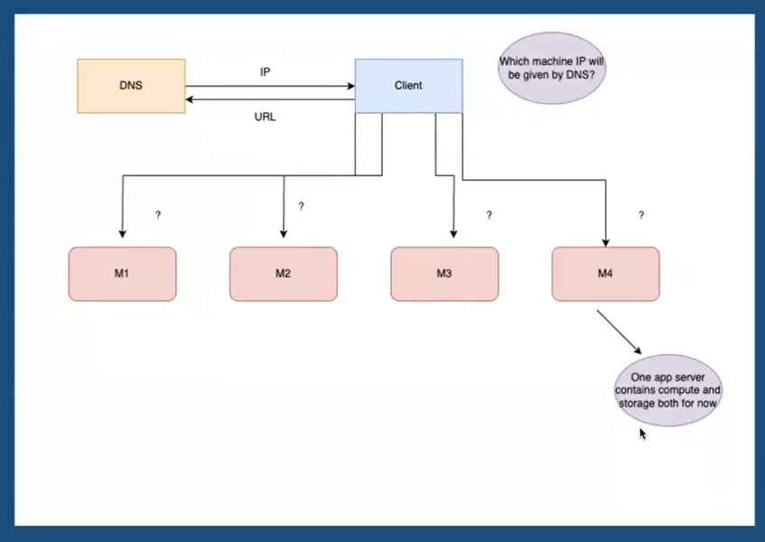
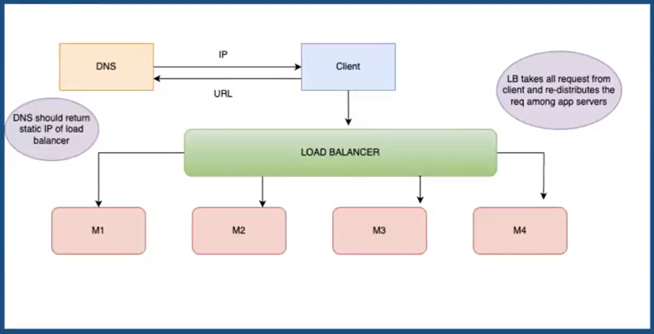
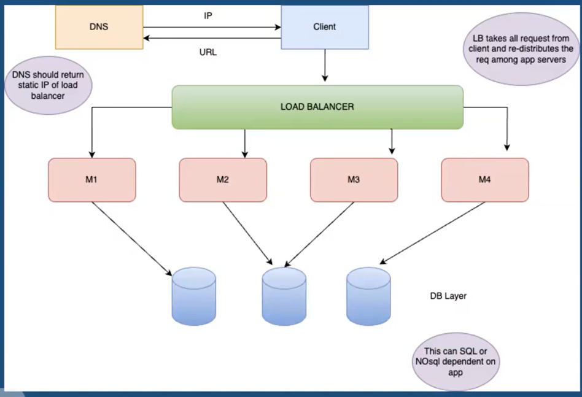

# Horizontal Scaling

- Rather than investing on getting more powerful machine why now have multiple machine of relatively mediocre power to handle all the load together.

- This way multiple normal machines can be deployed to manage them.

- Generally if you buy a machine of capacity (in terms of let's say RAM, storage etc) X, this will be more costly than buying multiple machines with capacity Y, where (Y < X).

### Which app server the client should now route your request to as there are 4 app servers running?



## DNS should not return IP of app servers. Why?

As we are using horizontal scaling then we have multiple machine running always.
If at some point we have more traffic than regular then we can setup a mechanism using which a new server with same config can spin up and share the load. This is called **AUTOSCALING**.
We can similarly scale down the no. of active machine in case of low traffic.
Because of the possibility of new machine spawning up and some shutting down we can't rely on their IP address to be returned by DNS.

### How to handle this?

How about we introduce an intermediate layer between client and app servers ?
We call this layer as **LOAD BALANCER**.
It can divide requests between different machines.

```
Using PM2 we can deploy the same servers on multiple CPU cores. The PM2 cluster mode allows Node.js applications (http(s)/tcp/udp server) to be scaled across all CPUs available, without any code modifications.
```
# Load Balancer




# Stateful systems V/S Stateless systems

## Stateless

A stateless process or application, however, does not retain information about the user's previous interactions. There is no stored knowledge of or reference to past transactions. Each transaction is made as if from scratch for the first time. Stateless applications provide one service or function and use a content delivery network (CDN), web, or print servers to process these short-term requests.
Eg. Weather App

## Stateful

Stateful applications and processes allow users to store, record, and return to already established information and processes over the internet. In stateful applications, the server keeps track of the state of each user session, and maintains information about the user's interactions and past requests. They can be returned to again and again, like online banking or email. They’re performed with the context of previous transactions and the current transaction may be affected by what happened during previous transactions. For these reasons, stateful apps use the same servers each time they process a request from a user. 
Eg. ChatGPT

**ChatGPT - Stateful System**

In case of ChatGPT, every running conversation is dependent on the context i.e. after 4-5 messages whatever message we share should have context about previous 4-5 messages. This kind of system is a **stateful** system.

If we store the context data in one app server that we receive in the request and then later any incoming set of request comes to a different app server then the app server won't be able to answer the question/request properly. In this kind of cases the LB have to do some extra piece of work as it needs to redirect the set of request to a particular app/server.
Due to the existence of the state inside the app server LB has to do some extra work.

### What is a stateless request?

- A "stateless request" in this context refers to an interaction that doesn't rely on or change any saved state of the system.

- This means that each request from a client to a server contains all the information needed for the server to understand and process the request.
The server does not store any context between requests. Every request is treated as an isolated and independent transaction.

- In cases of stateless request the app server layer is called as a stateless layer.

### How LB treats stateless request?

We can observe that for stateless requests there is no extra work that LB has to do, as any of the healthy app servers can entertain the incoming request.

This is because a single app server is able to handle any incoming request.
LB have bare minimium logic for stateless request.

### How about we separate the state outside of an app server into a DB layer?



### Isn't this a bit inefficient ?

- There will be a separate network call to the DB server.
- We might need locks or index step in the DB.
- We load the request in the app server memory forward it to DB, get the response back from the DB to app server's memory and then from the response send it back to the client.


### How about instead of just using a DB layer we introduce a layer of persistent cache also?

- General cache are volatile in nature.
- Persistent cache on the other hand uses diff techniques to store data and make it available later also.
- Example: Redis, memcache
- Redis is a in-memory cache but it creates backup data in the disk to recover data again when memory wipe happens.

### Problems with cache layer

- We can't also replace DB Layer with cache as they can't store too much data but if we introduce them then that improves the performance.
- Here because we might keep a global cache, there will be still a network call.
- Although other db overheads will be avoided.

### So do we never need stateful system?

There are cases where having stateful systems are a better choice.
Say we want to make an ad platform where based on user interaction we want to show similar ads based on what user is currently seeing and not based on history..
App focus more on what user is seeing rather than who the user is.
In this kind of system, we might need to have some online query based ML model. So what user is seeing now and on the go we might be making some online queries on that ML model and change the tuning paramters based on users request.

### Where should we keep these ML Models?

We will keep the model files in the app server only. Because if we detach the models from app servers then loading them in memory again and again is expensive task. Additional overhead like I/O and network calls are involved.

### Who will route the incoming request to the right app server ?

Load Balancers will be responsible as well. LB will use page type as a key for balancing.

# Load Balancers

A LB distributes incoming requests across our computing resources or app servers.

### Advantages of LB

If we use auto-scaling then it will be the responsibility of the load balancer to attach a new app server or detach an old stopped app server. It helps to detect over utilisation and under utilisation of app servers, so we can optimise our resources effectively.

### How LB registers or de-registers an app server?

There are 2 models to handle this:

- PULL (Heart Beat Model)
- PUSH

## Pull Model

- Also called as heart beat model.
- LB server regularly keeps on sending a request to app servers, registered in a REGISTRY, if the app server responses back then it is alive.
- If not then we assume the app server died.
- This is called Pull model because LB have to go manually and pull out the info. from the app server.

### But what about when we turn up a new app server?

In this case the new app server registers itself in the REGISTRY, and because LB regularly reads this, it will automatically start sending heartbeat signal to a new server.

## Push Model

- In push model, app servers themselves send request to LB denoting they are alive.
- LB doesn't initiate any request to app servers here.

### More use cases of load balancer

- We can extract out the encryption/decryption logic to LB instead of app servers.
- We can make LB support https request and internal app servers can be on HTTP without being exposed to everyone.

### How the lb will route the req to app servers?

- Round Robin
- Least active connection first (can be clubbed with RR to make it weighted RR). Which app server has got the lowest amount of active connections/reqs that they are actually serving.
- Least response time first (can be clubbed with RR to make it weighted RR). Which app server is responding the fastest.

## Types of Load Balancers

- Layer 7 [Application Layer in OSI]
- Layer 4 [Transport Layer in OSI]


### Layer 7 Load Balancer [Application Layer in OSI]

- Functionality: Distributes incoming traffic based on content type, URL, HTTP header, etc.

- Protocols: Works primarily with HTTP/HTTPS but can also handle other application layer protocols.

- Decision Making: Can make routing decisions based on the content of the message. For example, it can route a request to a specific server based on the URL path or the type of content requested (e.g., video vs. text).

- ALB or ELB in aws is Layer 7

- Performance: Can be slower than Layer 4 load balancers because it inspects packet content, but modern hardware and software optimizations have minimized this difference.

- Advanced Features: Supports features like SSL termination, cookie-based session persistence, content caching, and application firewall capabilities.

- Use Cases: Suitable for web applications where routing decisions need to be made based on content or when advanced features like SSL termination are required. More useful for basic microservice based architecture.

### Layer 4 Load Balancer [Transport Layer in OSI]

Layer 4 LB works on the Transport Layer and the main thing that happens with them is that they are in charge of delivering the message regardless of their content. They don't know what the content of the message is.

Eg. You are sending a JSON payload and in that payload, you are sending an UserID and if you have deployed an LB as a layer 4 LB, it does not care about what the UserID is. It will not redirect the request based on UserID. It does not care about what is the content of the incoming request. It just cares about the incoming requests' source and destination IP address and port number.

- Functionality: Distributes incoming traffic based on data like IP address and port numbers.

- Protocols: Typically works with TCP and UDP.

- Decision Making: Makes routing decisions based on the source and destination IP addresses and ports. It doesn't inspect the content of the packet.

- Performance: Generally faster than Layer 7 load balancers because it doesn't have to inspect packet content.

- Use Cases: Suitable for routing traffic where application-level content inspection is not required, such as VPN traffic or some types of VoIP.

- NLB in AWS is Layer 4